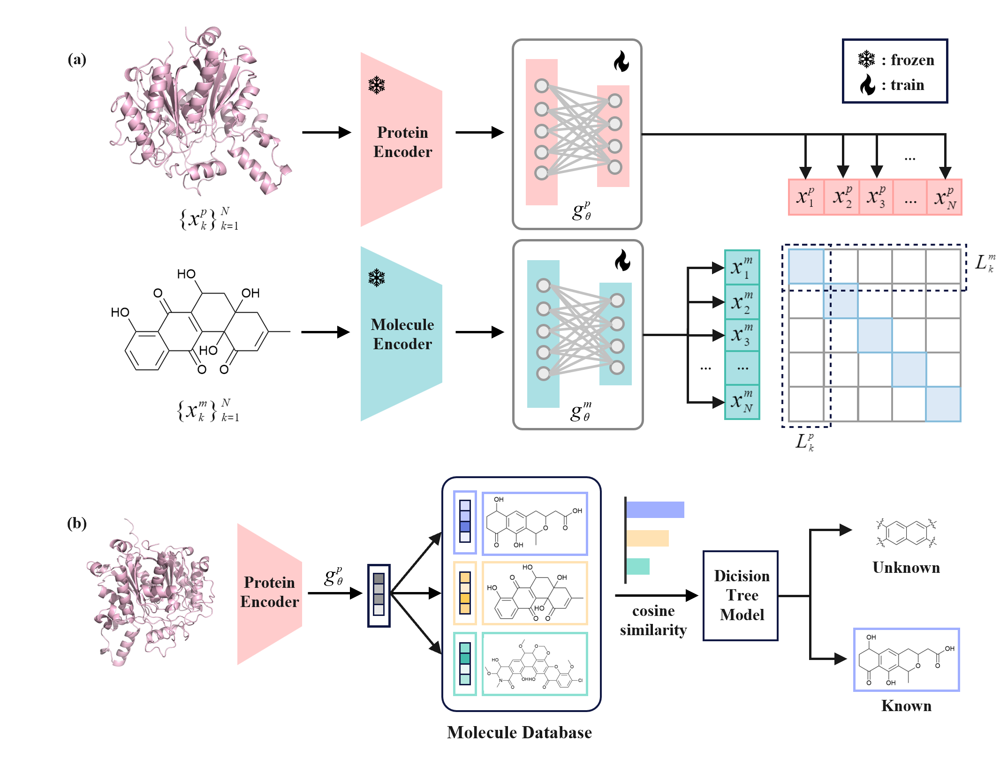

# MultiT2: Connecting Multimodal Data for Bacterial Aromatic Polyketide Natural Products

MultiT2 is an algorithm that connects disparate data from bacterial aromatic polyketides through multimodal learning. It specifically focuses on integrating protein sequences (CLFs) and chemical structures (SMILES) to predict and discover type II polyketide (T2PK) natural products.


## Overview

MultiT2 employs a novel approach inspired by CLIP to integrate:
- Protein sequences (using ESM2 as encoder)
- Chemical structures (using MoLFormer as encoder)

The model leverages contrastive learning to optimize the embeddings of these two data types within a high-dimensional space, ensuring that the embedding of a given CLF closely resembles the corresponding SMILES embedding.

Features:
- Prediction of known natural product structures
- Discovery of novel T2PKs
- Integration of protein sequence and chemical structure data
- High-precision structure prediction capabilities
- Novel scaffold detection

1. [Getting Started](#getting-started)
    1. [Pretrained Language Model](#pretrained-language-model)
    2. [Installation](#installation)
2. [Data](#data)
    1. [Input file](#input-file)
    2. [Output file](#output-file)
3. [Training](#training)
4. [Usage](#usage)
5. [Visualization](#visualization)

## Getting Started

### Pretrained language model

Before using MultiT2, you need to download two pretrained models and place them in the `models` directory: [ESM2](https://huggingface.co/facebook/esm2_t33_650M_UR50D/tree/main) 
And [MoLFormer](https://huggingface.co/ibm/MoLFormer-XL-both-10pct/tree/main).

### Installation
MultiT2 requires Python 3.8+ and several dependencies. We recommend using conda to manage the environment. All required packages can be installed using the provided `environment.yml` file. To set up the environment, follow these steps:

Clone the repository
```
git clone https://github.com/Gaoqiandi/MultiT2.git
cd MultiT2
```

Create and activate conda environment

```
conda env create -f environment.yml
conda activate MultiT2
```

## Data

### Input file

The `data` directory contains input files used during model training and inference.

- **`data/T2_data_norm.csv`:** This file serves as the input for training. It contains four columns:
  1. T2PK Compound Name
  2. Canonical SMILES
  3. CLF Protein Accession
  4. CLF Protein Sequence

  During training, the model takes pairs of SMILES strings and their corresponding protein sequences as input. The dataset is randomly split into a training set and a test set with an 8:2 ratio.

- **`data/test.fasta` and `data/ksb_2566.fasta`:** These files is used for inference. The model processes the CLF sequences in the file to predict the corresponding compound SMILES and returns the associated compound names.

### Output file

The `outputs` folder stores the output files generated by the model during inference.The format of the model's output files is as follows:
- For **in-domain samples**, the model outputs the top-K matched compounds along with their corresponding similarity scores.
- For **out-of-domain samples**, the model directly outputs 'Unknown product', indicating that the protein might be involved in the synthesis of a novel T2PK.
```
Protein 0 top 5 similar molecules:
  - Molecule Label: Alnumycin A, SMILES: CCC[C@H]1OC(C)=Cc2cc3c(c(O)c21)C(=O)C([C@H]1OC[C@@H](O)[C@H](CO)O1)=CC3=O, Similarity: 0.9309
  - Molecule Label: Isatropolone, SMILES: CCCC(=O)C1=C2C=C(C)Oc3c4c(c(=O)cc(c32)C1=O)C1(O)C(O4)OC(C)C(OC)C1O, Similarity: 0.0050
  - Molecule Label: Compound 2, SMILES: CC(=O)[C@H]1C[C@H]2OC(=O)[C@@]3(O)C(O)=C4C(=O)c5c(O)cccc5C(=O)[C@@]41C[C@@H]23, Similarity: 0.0049
  - Molecule Label: Compound 1, SMILES: CC(=O)[C@H]1C[C@H]2OC(=O)[C@@]3(O)C(O)=C4C(=O)c5c(O)cccc5C(=O)[C@]41C[C@@H]23, Similarity: 0.0046
  - Molecule Label: Granaticin, SMILES: CC1OC2CC(=O)OC2c2c(O)c3c(c(O)c21)C(=O)C1=C(C3=O)C2CC(OC3CCC(O)C(C)O3)C1(O)C(C)O2, Similarity: 0.0040

Protein 1: Unknown product
```

## Training

The `scripts/train.py` script demonstrates the training process of MultiT2, which employs an alternating training strategy using the following loss functions:
- **Contrastive Learning Loss**
- **Cross-Entropy Loss**

This dual-loss training approach alternates between classification and contrastive learning phases, enabling the model to achieve optimal weights. The best model weights are saved in `models/best_model.pth`.

All training parameters are provided in the `scripts/config.py` file. You can modify this file directly to customize the training process. If you want to reproduce our work, you can run the training code using the following commands:
```
cd scripts
python train.py
```

## Usage

We provide a command-line interface (`scripts/inference.py`) that efficiently performs inference in bulk from a FASTA file using MultiT2. 
```
usage: inference.py [-h] --fasta_file FASTA_FILE --model_weight_path MODEL_WEIGHT_PATH --output_file OUTPUT_FILE [--top_k TOP_K]

optional arguments:
  -h, --help                             Show this help message and exit
  --fasta_file FASTA_FILE
                                         Path to the input FASTA file.
  --model_weight_path MODEL_WEIGHT_PATH
                                         Path to the model weight file.
  --output_file OUTPUT_FILE
                                         Path to save the output results.
  --top_k TOP_K
                                         Number of top similar molecules to output per protein.
```

**Tips:** The inference process will automatically detect whether a GPU is available on the device. If no available GPU is detected, it will default to using the CPU for inference.

## Visualization

The `notebooks` directory provides visualization methods for our figures:

- **`t-SNE_visualization.ipynb`**  
  Visualizes protein and compound embeddings projected into the same vector space before and after training using t-SNE.

- **`Desicion_tree_model.ipynb`**  
  Visualizes the decision boundaries of the trained decision tree model, along with the distribution of similarity scores output by MultiT2.
